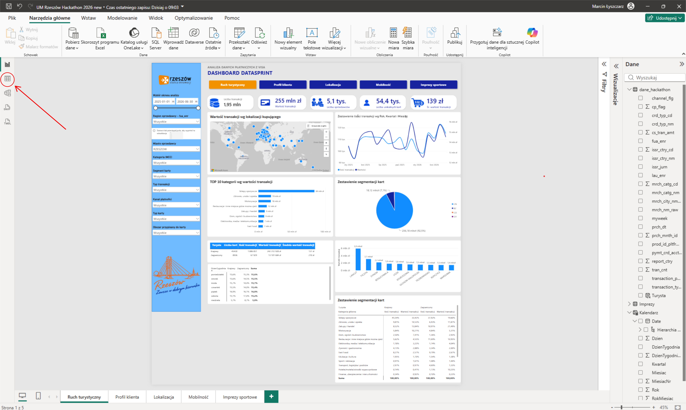
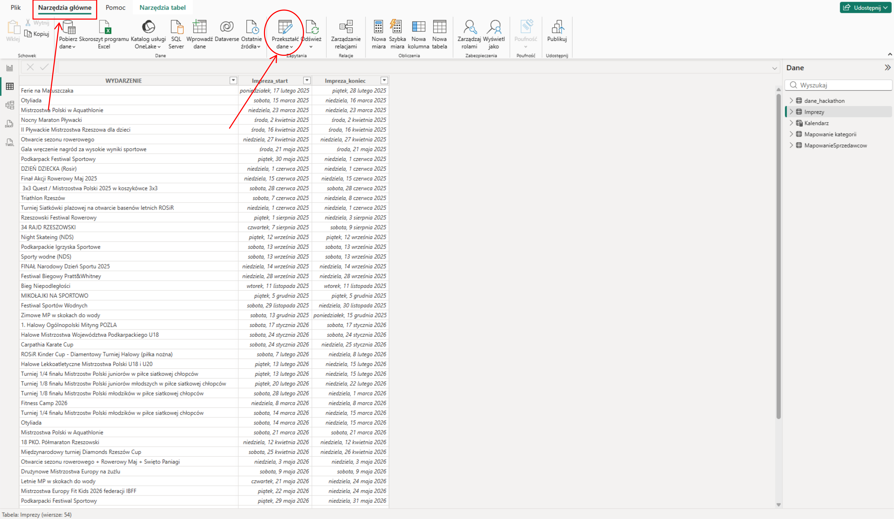
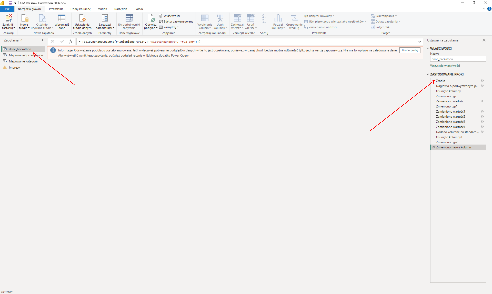
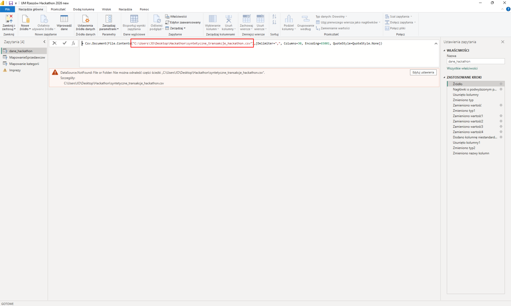

# datasprint-rzeszowteam
Team Rzeszow project for DATASPRINT Hackathon Presented by VISA

Obiektem tego repozytorium jest aplikacja norm mająca na celu wyodrębnienie podzbioru danych z podanego pliku z danymi w formacie parquet. Główną ideą aplikacji jest stworzenie podzbioru danych w czytelnej dla człowieka formie i mogących być załadowanymi do każdej aplikacji wspierającej format danych .CSV, w szczególności do raportu PowerBI będącego główną częścią projektu.

**WAŻNE**: Aplikacja została przygotowana i pracuje na zbiorach danych VISA w strukturze jaka została udostępniona na czas wydarzenia DATASPRINT Hackathon (liczba kolumn, nazwy kolumn, typ zawartych w nich danych).

# Obsługa raportu
Pobrany plik raportu przenieś do folderu `resources`. Wczytaj raport do aplikacji PowerBI poprzez podwójne kliknięcie na plik raportu lub poprzez wczytanie raportu z działającejjuż aplikacji PowerBI. Raport PowerBI bazuje na plikach, zawartych w folderze `resources` oraz na źródle danych wygenerowanym za pomocą aplikacji `norm` (Opis generowania danych poniżej).

Aby poprawnie wczytać lokalne pliki źródłowe danych pomocniczych należy otworzyć okno modelu danych:

Następnie należy wybrać zakładkę `Narzędzia Główne` na wstążce programu, a kolejno otworzyć menu `Przekształć Dane` -> `Przekształć Dane`

Otworzy nam się okno edycji źródeł danych. Najprawdopodobniej wszystkie zaznaczone źródła będą wyświetlały błąd wczytania danych. Korekta ustawień zostanie omówiona na przykładzie głównego źródła danych. Otwieramy źródło danych klikając na nie podwójnie, a następnie na liście po prawej stronie wybieramy Źródło:

W dalszym etapie musimy zamienić zawartą tam ścieżkę na ścieżkę do pliku, który w tym przypadku zostałby wygenerowany z wykorzystaniem aplikacji norm.

Mając utworzony plik z danymi do raportu klikamy na niego prawym przyciskiem i klikamy opcję `Kopiuj jako ścieżkę`. Następnie pamiętając aby skopiowaną ścieżkę umieścić pomiędzy pojedynczymi cudzysłowami, usuwamy starą ścieżkę i wklejamy nową w miejsce zaznaczone na powyższym obrazie. Następnie jeśli PowerBI nie odświeży zapytania automatycznie aby sprawdzić poprawność wczytywanego pliku danych możemy kliknąć `Odśwież podgląd`.

# Obsługa aplikacji norm
Aplikacja norm została utworzona jako uruchamiana z narzędzia terminala. W folderze głównym repozytorium znajdują się skrypty mające zbudować aplikację `norm` zarówno dla systemu Windows `build.ps1` oraz Linux/MacOS `build.sh`. Aby uruchomić skrypt należy przejść do głównego folderu repozytorium, klikamy prawym przyciskiem na pustą przestrzeń i wybieramy opcję `Otwórz w terminalu`. Uruchomienie skryptu odbywa się za pomocą komendy `./build.ps1` (w przypadku systemu Windows). W przypadku systemu MacOS/Linux należałoby jeszcze dodać do pliku uprawnienia wykonania poprzez komendę `chmod +x build.sh` I kolejno uruchomić komendą `./build.sh`.

Zbudowana aplikacja zostanie utworzona w folderze `norm.cli/bin/Release/net10.0`. Należy do niego przejść i również otworzyć go w terminalu. Postać komendy uruchamiającej aplikację jest następująca: 

`./norm.cli <parquet-path> <city-name[,city-name...]> [output-csv-path] [-<number>]`

Gdzie: 
- `parquet-path` to ścieżka do pliku z danymi w formacie parquet,
- `city-name` - lista oddzielonych przecinkami nazw miast, dla których chcemy wyekstrahować dane,
- `output-csv-path` - opcjonalna ścieżka do pliku wyjściowego (gdzie go zapisać),
- `number` - opcjonalnie liczba rekordów do klazuli LIMIT aby ograniczyć dane wyjściowe 

# Wykorzystane technologie:
- .NET 10, C#,
- DuckDB.Net.Data.Full, 1.2.0
- do stworzenia aplikacji została wykorzystana sztuczna inteligencja
- DuckDB engine
